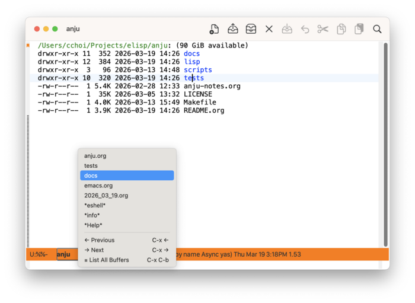
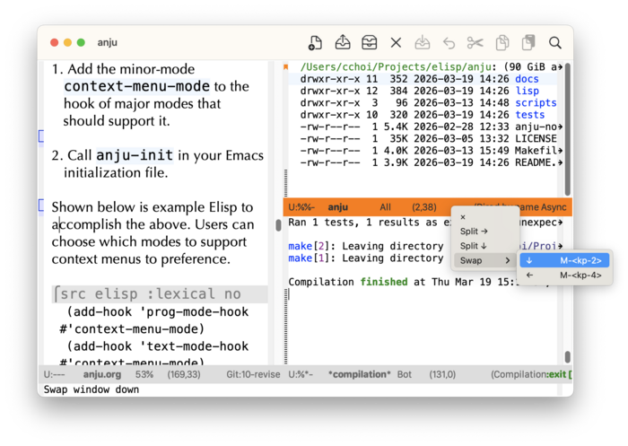
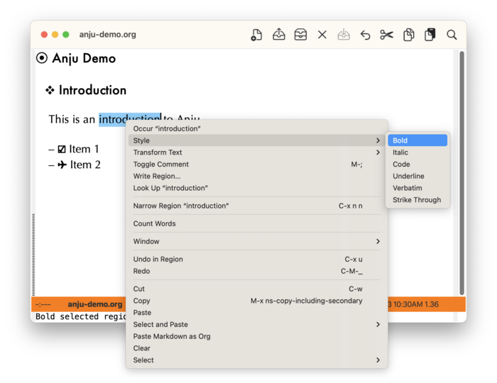
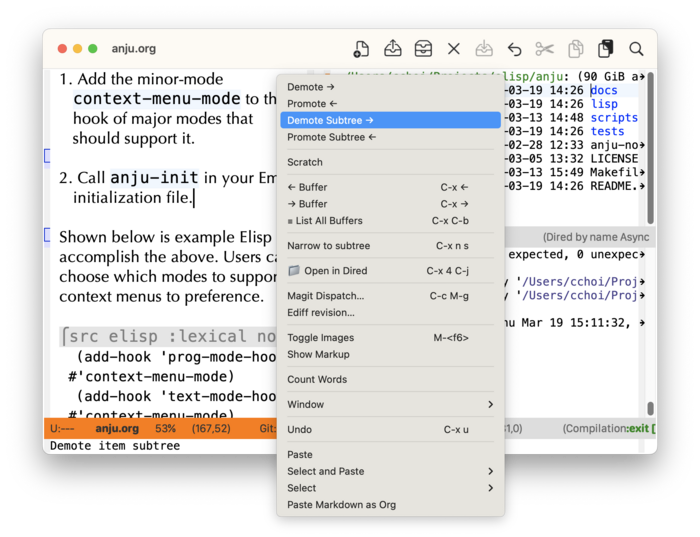
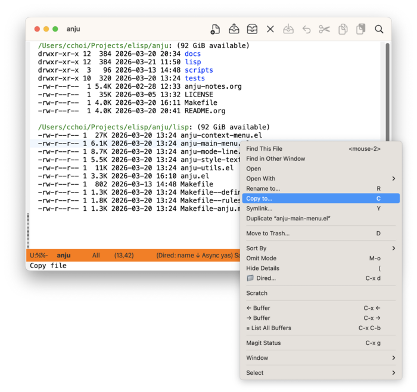
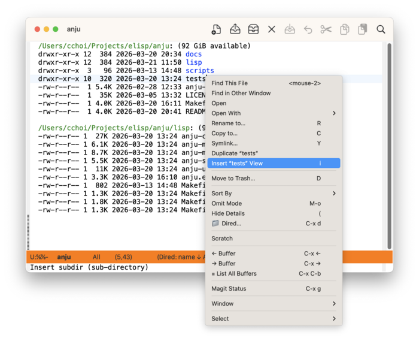
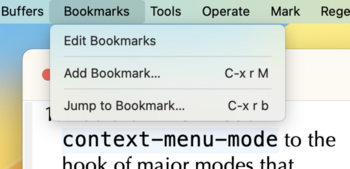
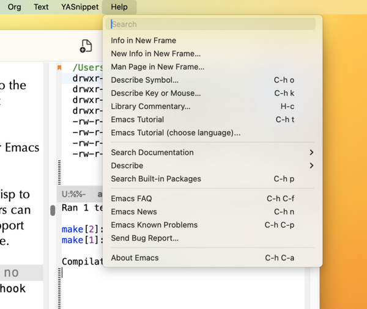

#+startup: overview nologdone
#+TITLE: Anju User Guide
#+SUBTITLE: for version {{{version}}}
#+AUTHOR: Charles Y. Choi
#+EMAIL: kickingvegas@gmail.com
#+OPTIONS: ':t toc:t author:t email:t H:4 f:t
#+LANGUAGE: en
#+MACRO: version 1.0.6-rc.1
#+MACRO: kbd (eval (org-texinfo-kbd-macro $1))
#+TEXINFO_FILENAME: anju.info
#+TEXINFO_CLASS: casual
#+TEXINFO_HEADER: @syncodeindex pg cp
#+TEXINFO_HEADER: @paragraphindent none
#+TEXINFO_TITLEPAGE: t
#+TEXINFO_DIR_CATEGORY: Emacs misc features
#+TEXINFO_DIR_NAME: Anju
#+TEXINFO_DIR_DESC: A package for customizing Emacs mouse interactions.
#+TEXINFO_PRINTED_TITLE: Anju User Guide

Version: {{{version}}}

#+TEXINFO: Copyright © 2026 @w{Charles Y. Choi}

Anju (안주) is a project to align mouse interactions in Emacs with contemporary (circa 2026) expectations. Effort towards this alignment is made in the following areas:

- Context-sensitive menus
- De-emphasis of middle mouse button usage (binding =<mouse-2>=)
- Support direct manipulation when possible
- Re-organization of the main menu bar

The features offered by Anju are opinionated, but avoids unconventional behavior. Anju aspires to bring a calmer mouse experience to Emacs.

Please note that all UI terminology in this document is Emacs-centric and differs from conventional GUI terminology. Refer to (emacs) Frames ([[info:emacs#Frames][emacs#Frames]]) for more detail on this.

#+INCLUDE: "./sponsorship.org"

* Copying
:PROPERTIES:
:COPYING: t
:END:

Copyright © 2026 Charles Y. Choi

* Motivation
#+CINDEX: Motivation

The Anju package is intended to change the default mouse interactions in Emacs for the following reasons:

- Uneven implementation of context-sensitive menus for different modes.
- Over-commitment to legacy usage of the middle mouse button.
- Lengthy menus that feel more like an inventory of commands rather than a designed user experience.
- Over-reliance on mouse workflows that require switching between the mouse and keyboard.

Anju makes opinionated design decisions, but avoids unconventional behavior. Anju aspires to bring a calmer mouse experience to Emacs.

Elaboration on what informs Anju's opinions is described below.

** Design Principles and Concerns
:PROPERTIES:
:CUSTOM_ID: design-principles
:END:

#+CINDEX: Design Principles and Concerns

This section conveys the principles and concerns used by Anju to inform its design decisions.

Editorially, all design decisions for Anju are ultimately the opinion of Charles Y. Choi.

#+TEXINFO: @subheading General Principles

- Menus should be organized.
  - A coherent information architecture should be conveyed.
  - Balance between concision and discoverability should be made in a menu's offerings.
- Nesting of sub-menus should be carefully considered, ideally not exceeding a depth of two.
- Mouse workflows that require keyboard input should be minimized.
- If the opportunity to provide a direct manipulation experience is available, it should be taken.
- Unconventional mouse interactions should be avoided.

#+TEXINFO: @subheading Concerns

Anju takes the position that different types of menus have different concerns or objectives. This is most apparent in contrasting the design of a main menu section (e.g. File, Edit, Options, …) to that of a context menu.

For Anju:

- The highest concern of a main menu section is discoverability.
- The highest concern of a context menu is concision.

A common implementation practice in Emacs is to reuse menu keymaps for both the main menu and context menus. This violates the above concerns, which Anju seeks to address.

The next sub-sections further detail the design concerns with respect to an area where mouse interaction occurs.

#+TEXINFO: @subsubheading Context Menu

A context menu (as its name implies) should constrain itself to commands relevant to /context/. The parameters of this context are usually (although not exclusively) defined by a subset of:

- Point (cursor) position
- Text selection
- Mouse cursor position
- Major mode
- Read-only state (on or off)

Anju takes the opinion that context menus should /not/ support general command discovery. The context menu offering should be /concise/. Users seeking command discovery should instead look at the main menu.

#+TEXINFO: @subsubheading Direct Manipulation

Support for direct action based on mouse cursor position is a common user interaction technique. Anju applies this to Emacs window management, where window creation, deletion, and swapping are supported from both the context menu and the mode line.

#+TEXINFO: @subsubheading No Middle Button Bindings

Anju eschews Emacs' default middle mouse button bindings as they presume usage of a [[https://upload.wikimedia.org/wikipedia/commons/thumb/e/ea/Sun_optical_mouse.jpg/960px-Sun_optical_mouse.jpg][90's style 3-button mouse]]. This style of mouse design has long been superseded with a middle [[https://upload.wikimedia.org/wikipedia/commons/2/22/3-Tasten-Maus_Microsoft.jpg][scroll-wheel+button control]]. This widespread hardware change has resulted in the majority of mouse-supporting applications to emphasize scrolling actions with the middle control and clicking actions to the left and right buttons. Anju follows suit, primarily binding the right mouse button click (down) event to raising a context menu. In addition, Anju reconfigures commands that were previously bound to the middle button to ones accessible via a context menu.

The only exception Anju makes in this matter is to keep the Emacs default binding of ~mouse-2~ to ~mouse-yank-primary~.

* Features
#+CINDEX: Features

Anju offers many enhancements to the mouse interactions provided by Emacs. These enhancements are detailed in the following sections below.

** Mode Line
:PROPERTIES:
:CUSTOM_ID: mode-line
:END:
#+CINDEX: Mode Line

The following mode line enhancements are provided by Anju:

#+TEXINFO: @subheading Pop-up Buffer List
#+CINDEX: Pop-up Buffer List

On the mode line, left-click (~mouse-1~) on the buffer name to raise a pop-up menu containing a list of open buffers. The contents of this list is controlled by the customizable variable ~anju-buffer-list-filter-functions~. More info on customizing the buffer list menu can be found in [[#mode-line-menu-customization][Mode Line Buffer List Menu Customization]].

#+TEXINFO: @subheading Window Management
#+CINDEX: Window Management

A right-click (~mouse-3~) on any blank space on the mode line will pop-up a window management menu.

From here, one can:
- Delete the window (×)
- Split the window horizontally (→)
- Split the window vertically (↓)
- If multiple windows are shown, swap the current window.

Note: usage of "window" refers to the Emacs definition of it. Refer to [[info:emacs#Frames][emacs#Frames]] for more detail on this.

#+TEXINFO: @subheading Toggle Maximize Window
#+CINDEX: Toggle Maximize Window

A left-double-click on any blank space on the mode line will checkpoint the current window configuration, then maximize the current window (~delete-other-windows~). Re-doing the left-double-click will restore the prior window configuration.

** Context Menu
:PROPERTIES:
:CUSTOM_ID: context-menu
:END:
#+CINDEX: Context Menu

Anju both works with and enhances ~context-menu-mode~ to support features like

- Selected Text Commands
  - Style (bold, italic, code, etc.)
  - Transform Text (upper/lower case, capitalize)
  - Occur
  - Toggle comment (when available)
  - Write to file (~write-region~)
- Mode-specific support
  - Org mode
  - Dired
- Window management based on mouse position
- Full support for ~context-menu-mode~ customization using ~context-menu-functions~.
  - See [[#context-menu-customization][Context Menu Customization]] for more info.

Anju is planned to have on-going development, with more commands and modes supported in future releases.

Shown below is an screenshot of a context menu when text is selected.

*** Org Mode Context Menu

The screenshot below shows a context menu for Org mode. Note that the upper part of the menu changes with respect to what kind of Org element (in the example below, a list item) the point is on.

Note that the Org mode context menu is intentionally restrained in its command offering in accord with Anju's [[#design-principles][Design Principles and Concerns]].

*** Dired Mode Context Menu

Anju has context menu support for Dired mode. The screenshot below shows the context menu when the mouse point is over a file.

If the mouse point is over a directory, the option to insert a view (aka subdir) for it in the buffer is provided.

Note that the Dired context menu is intentionally restrained in its command offering in accord with Anju's [[#design-principles][Design Principles and Concerns]].

*** Magit Support

If Magit 4.4+ is installed, then the context menu function ~anju-context-menu-vc~ will offer Magit commands depending on context. If the context menu is raised in a file buffer, then the menu item "Magit Dispatch…" (~magit-file-dispatch~) is shown, otherwise "Magit Status" (~magit-status~).

** Main Menu

Anju offers the following enhancements to the main menu:

#+TEXINFO: @subheading Bookmarks menu

To support usage of Emacs bookmarks, the following menu is added to the main menu.

#+TEXINFO: @subheading Re-organization of the Help menu

An opinionated re-organization of the Help menu is provided.

Anju provides support for customizing the enhancements ([[#main-menu-customization][Main Menu Customization]])
 to the main menu.

** Window Management

Window management via mouse interaction is provided for through the [[#mode-line][mode line]] and [[#context-menu][context menu]]. More detail is provided in those sections.

* Requirements
#+CINDEX: Requirements

Anju requires Emacs 29.1+, Casual 2.13+, Markdown Mode 2.7+.

Certain menus require more installed software:

- Anju Dired Support: GNU Coreutils (~ls~)
- Markdown import to Org: pandoc

Anju provides optional support for Magit 4.4+.
  
* Install
#+CINDEX: Install
#+VINDEX: context-menu-mode
#+VINDEX: anju-init

Basic installation of Anju composes of two parts:

1. Turn on ~context-menu-mode~ to major modes of preference. This is done using the ~add-hook~ function as shown below.
  #+begin_src elisp :lexical no
    (add-hook 'prog-mode-hook #'context-menu-mode)
    (add-hook 'text-mode-hook #'context-menu-mode)
    (add-hook 'dired-mode-hook #'context-menu-mode)
    (add-hook 'shell-mode-hook #'context-menu-mode)
  #+end_src

2. Call ~anju-init~ in your Emacs initialization file.

  #+begin_src elisp :lexical no
    (anju-init)
  #+end_src

Anju supports a high degree of customization. Users who wish this should make a deep read of the [[#customization][Customization]] section.

While not required, the following additions to your Emacs initialization file can further enhance your mouse experience:

- Enable ~org-mouse~
  #+BEGIN_SRC elisp :lexical no
    (require 'org-mouse)
  #+END_SRC

- Add Markdown export support to Org mode
  - ~M-x~ ~customize-variable~ ~org-export-backends~, check ~md~ option.

- Globally bind ~C-x 1~ to ~anju-toggle-one-window~.

  #+BEGIN_SRC elisp :lexical no
  (keymap-global-set "C-x 1" #'anju-toggle-one-window)
  #+END_SRC

- Set ~use-file-dialog~ to ~t~ to support mouse-driven-only dialog interactions, or ~nil~ to always get a mini-buffer prompt.

* Customization
:PROPERTIES:
:CUSTOM_ID: customization
:END:
#+CINDEX: Customization

Anju provides a number of ways to customize mouse interactions in Emacs. In many cases, Anju leverages off existing Emacs customization options, particularly around defining and modifying menus. Users who wish to modify menus in Emacs should familiarize themselves with menu keymaps ([[info:elisp#Menu Keymaps][elisp#Menu Keymaps]]) and the Easy Menu ([[info:elisp#Easy Menu][elisp#Easy Menu]]) library.

Customization options for the different areas Anju covers are detailed below.

** Anju Initialization (~anju-init~)
#+CINDEX: Anju Initialization
#+VINDEX: anju-init
#+VINDEX: anju-reconfigure-context-menu-functions-enable
#+VINDEX: anju-mode-line-bindings-enable
#+VINDEX: anju-unset-legacy-mouse-bindings-enable
#+VINDEX: anju-reconfigure-main-menu-enable
#+VINDEX: anju-help-menu-remove-emacs-tutorial
#+VINDEX: anju-reconfigure-main-menu-hook

Anju has a number of customizable variables that determine the behavior of ~anju-init~. They are:

- ~anju-reconfigure-context-menu-functions-enable~ :: Enable reconfiguration of the variable ~context-menu-functions~ with Anju-defined menu functions.

  If ~context-menu-functions~ is previously set via ~customize-variable~ then ~anju-init~ will make no changes to ~context-menu-functions~ regardless of how  ~anju-reconfigure-context-menu-functions-enable~ is set.

- ~anju-mode-line-bindings-enable~ :: Enable Anju-defined bindings for the mode line.

- ~anju-unset-legacy-mouse-bindings-enable~ :: Remove bindings using ~mouse-2~.

- ~anju-reconfigure-main-menu-enable~ :: Reconfigure the main menu.

  The variable  ~anju-reconfigure-main-menu-hook~ is a list of functions which each modify a different section of the main menu.

  If ~anju-reconfigure-main-menu-enable~ is ~t~, the variable ~anju-help-menu-remove-emacs-tutorial~ can control if the menu entries for the Emacs tutorial are shown.

By default, all the above ~*-enable~ variables are turned on (~t~).  Users preferring to make granular changes to ~anju-init~ can invoke ~M-x~ ~customize-group~ ~anju~.

** Context Menu Customization
:PROPERTIES:
:CUSTOM_ID: context-menu-customization
:END:

#+CINDEX: Context Menu Customization
#+VINDEX: context-menu-mode
#+VINDEX: context-menu-functions

Anju uses ~context-menu-mode~ (introduced in Emacs 28) to define its context menu behavior. This is accomplished through the customizable hook variable ~context-menu-functions~.

~context-menu-functions~ is a list of functions where each function has two arguments:

  - ~menu~ : reference to the context menu
  - ~click~ : a mouse event

When the context menu is raised, typically via right-click (~mouse-3~), each function in ~context-menu-functions~ is run, populating the context menu.

The following example Elisp illustrates an implementation of a context menu function.

  #+BEGIN_SRC elisp :lexical no
    (defun anju-context-menu-wordcount (menu click)
      "Context menu hook function for wordcount commands.

    - MENU: menu
    - CLICK: event

    This function is intended to be hooked into `context-menu-functions'."

      (save-excursion
        (mouse-set-point click)

        (when (derived-mode-p 'text-mode) ; context predicate
          (anju-context-menu-item-separator menu count-words-separator)
          (easy-menu-add-item menu nil ["Count Words"
                                        count-words
                                        :help "Count words"])))
      menu)
  #+END_SRC

Defining how a menu item is context-sensitive can be determined in multiple places:

  1. At the time of menu item definition
  2. At a higher level.

The /context/ is determined by a predicate which can take into account different things, among them:

  - Selected Text (~use-region-p~)
  - Major mode
  - Cursor (Point) position
  - Mouse position

In the example above, the context predicate is ~(derived-mode-p 'text-mode)~.  Note that it is defined at a higher level to avoid instantiating menu items if the context does not apply.

The context predicate can be embedded in the menu item definition itself. See more about this with the ~:visible~ and ~:active~ keywords for the macro ~easy-menu-define~.

It is up to the implementer to determine where to best apply the context predicate.

#+TEXINFO: @subheading Customizing context-menu-functions

It is recommended to use the ~customize-variable~ command to configure ~context-menu-functions~ instead of using ~add-hook~ for the following reasons:

1. A visual UI is provided showing what choices for built-in context menu functions are available.
2. Users can insert their own custom function.
3. Top-down ordering of functions will similarly determine the order of menu items in the context menu.

*** Anju Context Menu Functions
#+VINDEX: anju-context-menu-dired
#+VINDEX: anju-context-menu-org-mode
#+VINDEX: anju-context-menu-scratch
#+VINDEX: anju-context-menu-buffers
#+VINDEX: anju-context-menu-region
#+VINDEX: anju-context-menu-narrow
#+VINDEX: anju-context-menu-open-in
#+VINDEX: anju-context-menu-vc
#+VINDEX: anju-context-menu-markup
#+VINDEX: anju-context-menu-wordcount
#+VINDEX: anju-context-menu-window
                     
Anju provides the following context menu functions for convenience. They can be used as-is or serve as a base for user-customized behavior.

- ~anju-context-menu-dired~ :: Dired commands.

- ~anju-context-menu-org-mode~  :: Org mode commands.

- ~anju-context-menu-scratch~  :: Open scratch buffer.

- ~anju-context-menu-buffers~ :: Buffer navigation commands.

- ~anju-context-menu-region~ :: Commands for selected text.

- ~anju-context-menu-narrow~ :: Narrow-related commands.

- ~anju-context-menu-open-in~ :: Open in Dired.

- ~anju-context-menu-vc~ :: Version control related commands.
  If Magit 4.4+ is installed, then calls to it are made from here.

- ~anju-context-menu-markup~ :: Commands to show/hide text markup (e.g. Org, Markdown).

- ~anju-context-menu-wordcount~ :: Word count command.

- ~anju-context-menu-window~ :: Window management commands.

** Mode Line Buffer List Menu Customization
:PROPERTIES:
:CUSTOM_ID: mode-line-menu-customization
:END:
#+CINDEX: Mode Line Buffer List Menu Customization
#+VINDEX: anju-buffer-list-filter-functions
#+VINDEX: anju-mode-line-buffer-list-function
#+VINDEX: anju-buffer-list-plain-filter
#+VINDEX: anju-buffer-list-compilation-filter
#+VINDEX: anju-buffer-list-grep-filter
#+VINDEX: anju-buffer-list-xref-filter
#+VINDEX: anju-buffer-list-eshell-filter
#+VINDEX: anju-buffer-list-shell-filter
#+VINDEX: anju-buffer-list-info-filter
#+VINDEX: anju-buffer-list-help-filter
#+VINDEX: anju-buffer-list-menu-items
#+VINDEX: anju-popup-buffer-menu

The pop-up buffer list menu can be customized two ways:

1. Customizing the variable ~anju-buffer-list-filter-functions~, a list of filter functions that are run each time the pop-up menu is raised when left-clicking the mode line buffer name.

2. Customizing the variable ~anju-mode-line-buffer-list-function~, which gives a user complete control on what is displayed in the pop-up menu.

#+TEXINFO: @subheading anju-buffer-list-filter-functions

This variable is an alist used by the function ~anju-buffer-list-menu-items~ to populate the list of buffers used in the pop up menu ~anju-popup-buffer-menu~.

This alist is filled using the following key, value pair types:

- key :: a buffer list filter function
- value ::  integer used as the maximum count of buffers to use from the filter function

The buffer list filter function is of the form ~(filter-fn (buffers &optional count))~ where buffers is a list of buffers (usually ~buffer-list~) and count is the maximum count of buffers to use.

The order of the buffer list presumes the most recently used buffers are
at the front of the list.

Anju provides the following buffer filters:

- ~anju-buffer-list-plain-filter~ :: buffers whose name is not marked as special (a name wrapped in ‘*’).
- ~anju-buffer-list-compilation-filter~ :: buffers whose major mode is ~compilation-mode~.
- ~anju-buffer-list-grep-filter~ :: buffers whose major mode is ~grep-mode~.
- ~anju-buffer-list-xref-filter~ :: buffers whose major mode is ~xref--xref-buffer-mode~.
- ~anju-buffer-list-eshell-filter~ :: buffers whose major mode is ~eshell-mode.~
- ~anju-buffer-list-shell-filter~ :: buffers whose major mode is ~shell-mode~.
- ~anju-buffer-list-info-filter~ :: buffers whose major mode is ~Info-mode~.
- ~anju-buffer-list-help-filter~ :: buffers whose major mode is ~help-mode~.

Users can customize ~anju-buffer-list-filter-functions~ to re-compose or add their own filters to define the resulting buffer list returned by ~anju-buffer-list-menu-items~. It is recommended that the ~customize-variable~ command be used to accomplish this.

#+TEXINFO: @subheading anju-mode-line-buffer-list-function
#+VINDEX: anju-mode-line-buffer-list-function

Function that populates the mode line buffer name popup menu.

Assign this variable to a function that returns a value that conforms to the ~MENU~ parameter of the command ~popup-menu~.

This setting allows for customization of the buffer list (or any other menu content) when the mode line buffer name (identifier) is clicked (typically with ~mouse-1~).

Users who wish define their own menu should override this value with their own function. It is recommended that such users look at the source to ~anju-buffer-list-menu-items~ as a start to defining their own menu function.

** Main Menu Customization
:PROPERTIES:
:CUSTOM_ID: main-menu-customization
:END:
#+CINDEX: Main Menu Customization
#+VINDEX: anju-main-menu--reconfigure-text-mode
#+VINDEX: anju-main-menu--reconfigure-bookmarks
#+VINDEX: anju-main-menu--reconfigure-help
#+VINDEX: anju-help-menu-remove-emacs-tutorial

Anju modifies the main menu via the customizable hook variable ~anju-reconfigure-main-menu-hook~. This hook is run in the command ~anju-init~.

By default, the following hook functions are run:

- ~anju-main-menu--reconfigure-text-mode~ :: Reconfigures Text menu for text mode buffers.
- ~anju-main-menu--reconfigure-bookmarks~ :: Adds Bookmarks menu to main menu.
- ~anju-main-menu--reconfigure-help~ :: Reconfigures Help menu.
  - Set the customizable variable ~anju-help-menu-remove-emacs-tutorial~ to ~t~ if removing the tutorial entries is desired.

~anju-reconfigure-main-menu-hook~ can be modified to add additional custom hook functions. Users who wish to do this should familiarize themselves with menu keymaps ([[info:elisp#Menu Keymaps][elisp#Menu Keymaps]]) and the Easy Menu ([[info:elisp#Easy Menu][elisp#Easy Menu]]) library.

Shown below is an example Elisp function which modifies the “Text” menu section of the main menu for modes which derive from ~text-mode~.

  #+BEGIN_SRC elisp :lexical no
  (defun anju-main-menu--reconfigure-text-mode ()
    "Reconfigure Text mode menu."
    (easy-menu-remove-item text-mode-menu nil "Center Line")
    (easy-menu-remove-item text-mode-menu nil "Center Region")
    (easy-menu-remove-item text-mode-menu nil "Center Paragraph")
    (easy-menu-remove-item text-mode-menu nil "Paragraph Indent")
    (easy-menu-remove-item text-mode-menu nil "---")

    (easy-menu-add-item text-mode-menu nil anju-transform-text-menu "Auto Fill")
    (easy-menu-add-item text-mode-menu nil anju-style-menu "Auto Fill"))
  #+END_SRC

* Future Work
#+CINDEX: Future Work

Work on Anju is on-going. Plans for future enhancements include:

- Support for more built-in modes
- Further changes to the main menu

Although much consideration on both the user and developer experience has been made, they are both subject to change in future releases if a better approach presents itself.

* Feedback & Discussion
#+CINDEX: Feedback
Please report any feedback about Anju to the [[https://github.com/kickingvegas/anju/issues][issue tracker on GitHub]].

#+CINDEX: Discussion
To participate in general discussion about using Anju, please join the [[https://github.com/kickingvegas/anju/discussions][discussion group]].

* Sponsorship
#+CINDEX: Sponsorship

It costs money to make, enhance, and maintain Anju as ideologically free software. If you enjoy using Anju, please buy me a coffee to help support its development and maintenance.

[[https://www.buymeacoffee.com/kickingvegas][buymeacoffee.com/kickingvegas]]

* About Anju
#+CINDEX: About Anju

[[https://github.com/kickingvegas/anju][Anju]] was conceived and crafted by Charles Choi in San Francisco, California.

Thank you for using Anju.

Always choose love.

* Acknowledgments
#+CINDEX: Acknowledgments

Thanks goes out to the contributors to ~mouse.el~, whose work this package builds upon.

* Main Index
:PROPERTIES:
:INDEX:    cp
:END:

Index for this user guide.

* Variable Index
:PROPERTIES:
:INDEX:    vr
:END:

Variables, functions, commands, and menus referenced by this user guide.
